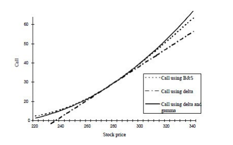

.. Dash app documentation master file, created by
   sphinx-quickstart on Wed May  4 19:44:18 2022.
   You can adapt this file completely to your liking, but it should at least
   contain the root `toctree` directive.

OptionAnalytica - A Dashboard for Risk Managers
=================================================

:Author: Gianluca Baglini, David Alcala
:Source code: https://github.com/gbaglini/Dash-app
:Issues: https://github.com/gbaglini/Dash-app/issues
:Generated: |today|
:License: MIT/Expat
:Version: |release|

.. include:: ../../README.rst

Usage
==================

| OptionAnalytica beta version is componsed of three main tabs:

*  BuildPortfolio
*  PortfolioStats
*  ScenarioAnalaysis

| **BuildPortfolio**
| In the BuildPortfolio tab the user can create his/her custom option portfolio by freely choosing from US option exchanges.
| After the ticker and exchange selection, the tabs display volatility surfaces and volatility smiles for the selected option chain.
| The two plotly charts contribute to a better option picking process. The user can then add one or more options to his/her portfolio.
| One the selection procedure is complete, the Create Portfolio button terminates the selection and set up the variables for the other tabs.

| **PortfolioStats**
| The PortfolioStats shows an insightful view on the options greeks and portfolio value in term of exposure against the underlying index
| ValueDelta, ValueGamma and ValueVega are computed on signle positions and at portfolio level.
| The Option Payoff chart displays options diagram for each ticker and expiration pair.

| **ScenarioAnalysis**
| ScenarioAnalysis tab allows to simulate customized market scenarios and evaluate the effects of the created portfolio.
| The user can input values for:

*  drift
*  volatility
*  10Y-Treasury rate
*  Probability of Jump
*  Size of the Jump
*  Horizon

Once these parameters are set, the Simulate scenario button runs N simulations on data modelling the market index as a Geometric Browian Motion (BGM) with given drift and volatility

Financial Knowledge
=====================

.. glossary::

   Delta
      Delta (Δ) is a risk metric that estimates the change in price of a derivative, such as an options contract, given a $1 change in its underlying security.

   Gamma
      Gamma is the rate of change in an option's delta per 1-point move in the underlying asset's price. Gamma is an important measure of the convexity of a derivative's value, in relation to the underlying

   Delta-Gamma Approximation
      The delta-gamma approximation is used to estimate option price movements if the underlying
      stock price changes. It is used as it is better than the delta approximation which is linear. The option
      price is a non-linear function of the stock price. To take account of this we can use gamma to make our
      option price estimate more precise. Delta-gamma makes our approximation non-linear.

.. glossary::

   Risk-free rate
      The risk-free rate of return is the theoretical rate of return of an investment with zero risk.
      The risk-free rate represents the interest an investor would expect from an absolutely risk-free investment over a specified period of time.

   Taylor Expansion
      In mathematics, the Taylor series of a function is an infinite sum of terms that are expressed in terms of the function's derivatives at a single point.

   Vega
      Vega is the measurement of an option's price sensitivity to changes in the volatility of the underlying asset.
      Vega represents the amount that an option contract's price changes in reaction to a 1% change in the implied volatility of the underlying asset.

   Volatility Smile
      A volatility smile is a common graph shape that results from plotting the strike price and implied volatility of a group of options with the same underlying asset and expiration date.

   Volatility Surface
      The volatility surface is a three-dimensional plot showing the implied volatilities of a stock's options that are listed on it across different strike prices and expirations.

Code Documentation
==================

.. automodule:: utils_IB
   :members:
   :show-inheritance:

Indices and tables
==================

* :ref:`genindex`
* :ref:`modindex`
* :ref:`search`
